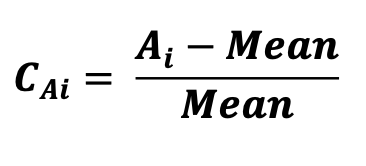
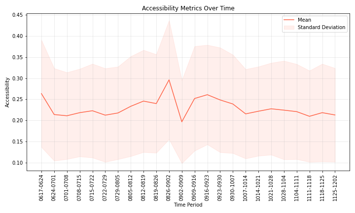
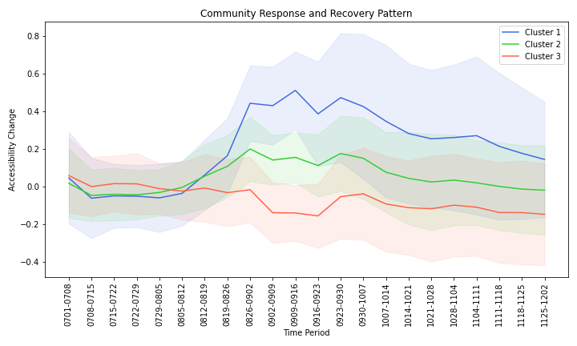

# Dynamic Accessibility Measurement

## Overview
This project is part of my bachelor's graduation thesis, focusing on analyzing human mobility data to study accessibility changes in response to extreme events. By examining mobility data before, during, and after a hurricane event, the study identifies trends in community resilience and recovery. 

## Data
The raw data was sourced from SafeGraph, containing anonymized weekly visits to Points-of-Interest (POIs). The pre-processed dataset used for this project is included in the repository for further analysis.

## Methodology

1. Data preprocessing: Cleaning and organizing the raw data. (This step is pre-done since the raw datasets are extensive and not the main focus of the project.)
2. Accessibility measurement: Quantifying accessibility metrics for each community and calculating the changes in accessibility across different phases of the event.
3. Trend analysis: Examining community response patterns and clustering similar responses using agglomerative clustering.

Accessibility metric: 

The accessibility metric reflects how accessible a service (e.g., gas stations) is to a community, based on the number of visits to specific POIs within the area. A distance decay function is applied to account for the sensitivity of accessibility to the distance between a community and the POIs.

Accessibility changes:  

To assess community responses to extreme events, the accessibility changes before, during, and after the event are calculated. Agglomerative clustering is employed to identify trends in community response and recovery based on these changes.

## Code Descriptions

1. accessibility_metrics.py : Calculates accessibility metrics for each CBG for gas stations.
2. merge.py: Merges weekly data files into a single dataset for easier analysis.
3. plot.py: Plots the average accessibility metric for CBGs in the study area to analyze trends over the study period.
4. accessibility_change.py: Calculates changes in accessibility during and after the hurricane event.
5. clustering.py: Applies agglomerative clustering to identify patterns in community response.
6. errorbar.py: Visualizes community response and recovery patterns using error bar plots.
   
## Results
Key insights included:
- Changes in Accessibility: Significant variations in accessibility metrics pre- and post-event.
  
- Community Resilience: Clustering analysis reveals different patterns of community response and recovery.
  

